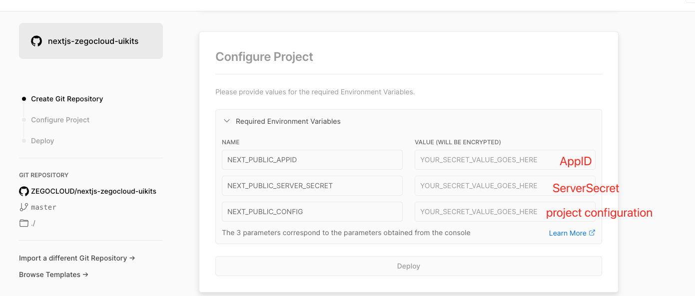

# Voice and Video CAll Feature Using ZEGO Cloud

### Enables User to Make Live Streaming , Voice Calling , Video Calling , Room Interaction , Private Rooms etc

# Project Introduction

### step 1
[click  ![Deploy with Vercel] (https://vercel.com/button)](https://vercel.com/new/clone?repository-url=https%3A%2F%2Fgithub.com%2FZEGOCLOUD%2Fnextjs-zegocloud-uikits&env=NEXT_PUBLIC_APPID,NEXT_PUBLIC_SERVER_SECRET,NEXT_PUBLIC_CONFIG&envDescription=The%203%20parameters%20correspond%20to%20the%20parameters%20obtained%20from%20the%20console&envLink=https%3A%2F%2Fgithub.com%2FZEGOCLOUD%2Fnextjs-zegocloud-uikits%23readme&project-name=nextjs-zegocloud-uikits&demo-title=nextjs-zegocloud-uikits&demo-description=nextjs-zegocloud-uikits)

### step 2

Fill in the corresponding parameters


# run the project locally

- Open the `.env.local` file, and fill in the obtained relevant configuration(Secret,Ap_ID,Configuration).

- run on current project
  ````
   npm run install
  ````
- then run
  ````
   npm run dev
  ````
